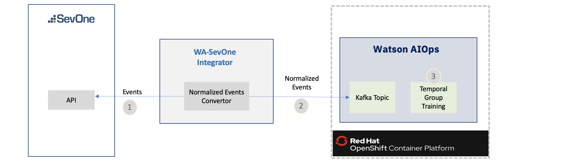
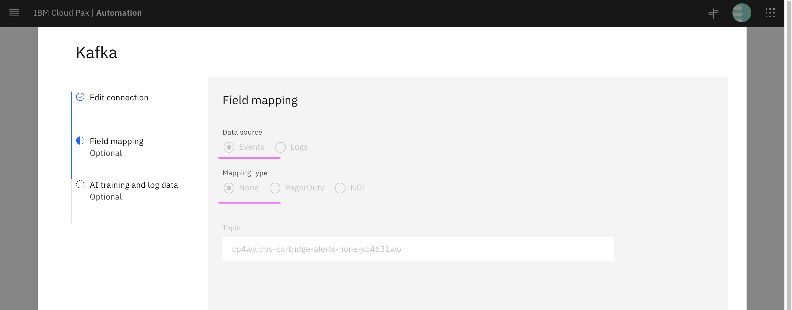
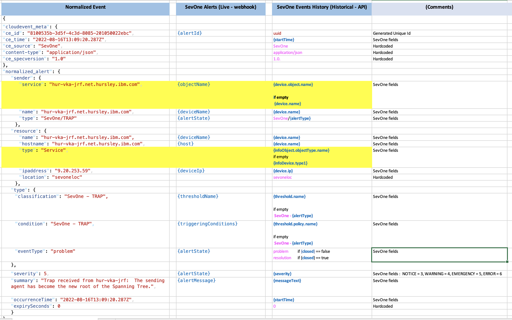
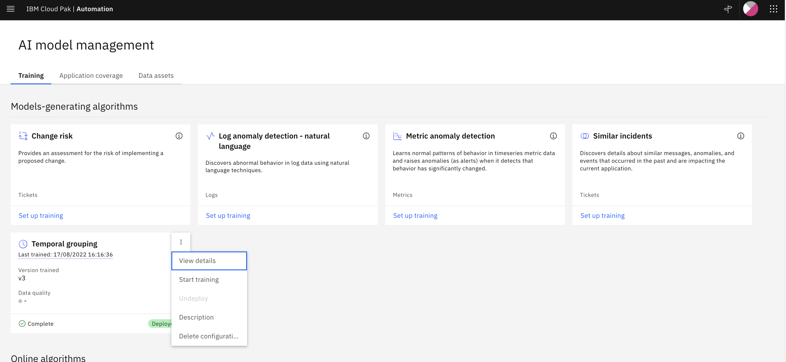
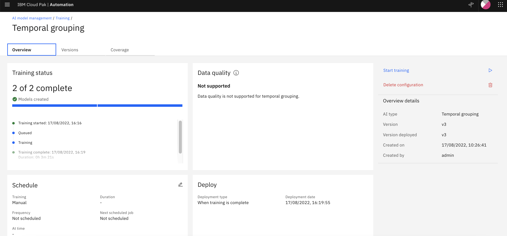

# Watson AIOps 3.5 Temporal Group Training with SevOne Events

The IBM SevOne NPM alerts or events could be configured to send to Watson AIOps to leverage AI-capabilities to pull and analyze data from multiple IT platforms to help with ITOps management. 

Watson AIOps can correlate and do various grouping of events. The temporal grouping is an unsupervised learning AI-algorithm that groups alerts that are discovered to co-occur over time. Watson AIOps can auto learn over a period of time based on the incoming events. But there is also a possibility to dump the events history at once and do the training. 

This document explains how to download SevOne event history, convert them into WAIOps Normalized event format and push to Watson AIOps 3.5 Kafka topic for the temporal group training.


The script is available in [scripts](./scripts) folder.




## 1. Update Properties

### 1.1 Update SevOne Properties

The property file [scripts/run/00-config.sh](./scripts/run/00-config.sh) to be updated with the followings.

1. SevOne Access details.

```
#### SevOne - Access Parameters
export SEVONE_URL="http://aaaa"
export SEVONE_USER="bbbbb"
export SEVONE_PWD="ccccc"
```

2. Event History Details

```
#### Event History - Parameters
export SEVONE_EVENT_HISTORY_DAYS=2
export MAX_NORMALIZED_EVENTS_PER_FILE=500
```
- The Property `SEVONE_EVENT_HISTORY_DAYS` indicates that how many days old events history to be downloaded.

- The Property `MAX_NORMALIZED_EVENTS_PER_FILE` indicates that how many normalized events should be put in a single file.  

### 1.2. Update WAIOps Properties

#### 1.2.1 Update 01-config.sh

The property file is available here [scripts/kafka/01-config1.sh](./scripts/kafka/01-config1.sh).

The below property to be updated with Kafka topic name that was created in WAIOps.

```
TOPIC_NAME=cp4waiops-cartridge-alerts-none-xo4631wo
```


#### 1.2.2 Update 02-config2.sh

1. Login into the OCP Cluster where WAIOps is installed 

```
oc login ....
```

2. Run the below script to generate Kafka access details. This will overwrite this config file  [scripts/kafka/02-config2.sh](./scripts/kafka/02-config2.sh) with the kafka access details.

```
cd scripts/kafka
sh 10-generate-config.sh
```

## 2. Download Events and Convert

The Events History to be downloaded from SevOne and converted into the WAIOps Normalized format. 

1. Run the below script to do the same.

```
cd scripts/run
sh 32-run-local-event-history.sh
```

#### 2.1 SevOne

- The Property `SEVONE_EVENT_HISTORY_DAYS` indicates that how many days old events to be downloaded.

- There could be lot of events, if we try to download for all the 90 days at once. So API is called in loop with time range of 1 day.

- The downloaded events would be stored in the folder  [./data/input/event-history/sevone](./data/input/events-history/sevone)

#### 2.2 Normalized Events

- Each sevone file from the above folder will be processed and it is converted into Normaized events format.

- The Property `MAX_NORMALIZED_EVENTS_PER_FILE` indicates that how many normalized events should be put in a single file.  When the no. of events are more then it is better to write in another file. The file name is suffixed with running number.

- The result files would be available in the folder  [./data/input/event-history/waiops](./data/input/events-history/waiops)

#### 2.3 SevOne to Normalized Events Mapping

SevOne to Normalized events mapping is given below. 



## 3. Push the Event-History to KAFKA topic

Run the below script to push the downloaded SevOne event history into WAIOps kafka topic.

```
cd scripts/kafka
sh 21-push-to-events-topic.sh
```
- This will push all the event files available in the folder [./data/input/event-history/waiops](./data/input/events-history/waiops)


## 4. Temporal Training

Do the temporal training.





